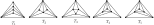
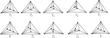
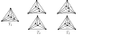
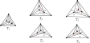

# Группоид и узлы

У нас есть группоид цветных кос. Зафиксируем начальное положение точек динамических систем, чтобы точки были расположены вдоль линии. Мы знаем, что любую косу можно свести к динамической системе в которой не возникает пятиугольников, если точки последовательно обходят друг друга. Замкнем получаемые слова тем, что добавим в них новые соотношения, т.е. скажем, что два слова эквивалентны, если одно из другого получается сдвигом. Получим непонятно что, но наверное это будет тоже группоид т.к. склеивать (умножать) такие циклические слова можно по разному, хотя и не всегда. А далее нам нужно приравнять движения маркова к единице путем добавления нового соотношения. И хорошей новостью может быть то, что второе движение маркова в такой конструкции может иметь либо 3 либо 4 последовательных флипа. Можно даже ограничиться тремя флипами. Поэтому если в нашем замкнутом слове есть такие последовательности из трех флипов, то мы можем их сократить. И получаем слово для узла. Но здесь непонятно как нам отличать вторые движения маркова от нужных нам сигм узлов? Может ли второе движение Маркова быть только одним в косе? Типа если их два, то это уже будет какой-то узел или зацепление, а не петля. Можно ли тогда отделить это движение от всех остальных?

Также не очень понятно, как нам подружить триангуляции с разными числом точек. Например, трилистник можно представить как замкнутую косу на двух нитях и на трех нитях. Для косы на двух нитях у нас будет один группоид, для косы на трех нитях -- у нас другой группоид. Если в группоиде для косы на трех нитях сократить то, что соответствует второму движению маркова, то мы получим слово, которое все равно живет в этом группоиде, но никак не в группоиде флипов в котором строятся косы из двух нитей. Чтобы подружить эти два группоида нам нужно строить какое-то отображение из одного в группоида в другой. Это отображение надо задавать на образующих. Но как сопоставить образущим группоида кос на дву нитях группоиду кос на трех нитях? Как минимум число образующих будет разным в этих группоидах, т.к. число триангуляций разное. Нужно, чтобы несколько образующих отображалось в какую-то одну или в единицу. Но пока что это совершенно непонятно.

С цветными косами возникают дополнительные трудности уже на этапе сопряженности, т.к. две косы не взаимоуничтожатся при замыкании, т.к. образующие будут разные у верхней косы и у нижней, если только это не замыкание. Поэтому слово для узла вообще не получается нормально замкнуть из-за того, что у образующих нет общих индексов триангуляций. И поэтому для узлов верхняя и нижняя косы сопряжения не сократятся просто так.

Чтобы сопряженность получилась, необходимо отождествлять триангуляции по перестановкам (т.е. не обращать внимание на лэйблы на точках). Это именно то, что я рисовал в файле [trefoil_in_words_groupoid.svg](../images/trefoil_in_words_groupoid.svg). Тогда в начале слова и в конце слова индексы у образующих совпадают. Значит, надо думать, как с такими словами работать и как в них устранить движение 2 маркова.
Вот эти триангуляции в явном виде:

Если зафиксировать 3 внешние точки, то можно получить 5 триангуляций, если сравнивать их с точностью до поворотов, это триангуляции $T_1-T_5$, которые нарисованы в указанном файле в самом верху.

Если отождествлять триангуляции получаемые отражением, то их остается вообще 4: $T_1-T_4$, но тогда у нас пропадает возможность различать прямые и обратные сигмы, что заведомо уменьшает возможности инварианта, т.к. тогда как минимум не будет различаться левый и правый трилистник, что нам не устраивает. Пример на рисунке ниже.

Из рисунка видно, что если триангуляции $T_4$ и $T_5$ отождествить, то получатся два одинаковых слова для прямой и обратной кос. Поэтому отождествлять отражение не надо. Можно запретить отождествлять триангуляции получаемые друг из друга поворотами, но тогда получится больше образующих. Возможно, это здравая идея, т.к. пока еще не понятно, получится ли что-то если повороты отождествлять. Поэтому сначала попробуем с отождествлением поворотов, а потом, если не получится, то без отождествления поворотов.

Из таких триангуляций можно получить следующие образующие: $g^{T_1}_{T_2}$, $g^{T_2}_{T_3}$, $g^{T_3}_{T_4}$, $g^{T_3}_{T_5}$, $g^{T_1}_{T_4}$, $g^{T_1}_{T_5}$, $g^{T_4}_{T_5}$. Мы по прежнему получили группоид, а не группу, т.к., например, умножение $g^{T_1}_{T_2}g^{T_3}_{T_4}$ неопределено, т.к. $T_2$ и $T_3$ -- это разные триангуляции. Но можно ли получить представление кос?

Попробуем отобразить образующие $\sigma_1,\sigma_2$ группы кос $B_3$ в полученный группоид.
$$
\begin{gather*}
\sigma_1 = g^{T_1}_{T_2}g^{T_2}_{T_3}g^{T_3}_{T_5}g^{T_5}_{T_1},\\
\sigma_2 = g^{T_1}_{T_5}g^{T_5}_{T_4}g^{T_4}_{T_1}.
\end{gather*}
$$

Запишем два трилистника на трех нитях: с одним добыный, в пторой -- на двух нитях с движением Маркова.

Первый: $\sigma_1\sigma_2\sigma_1\sigma_2 \mapsto (g^{T_1}_{T_2}g^{T_2}_{T_3}g^{T_3}_{T_5}g^{T_5}_{T_1})(g^{T_1}_{T_5}g^{T_5}_{T_4}g^{T_4}_{T_1})(g^{T_1}_{T_2}g^{T_2}_{T_3}g^{T_3}_{T_5}g^{T_5}_{T_1})(g^{T_1}_{T_5}g^{T_5}_{T_4}g^{T_4}_{T_1})$,

Второй: $\sigma_1\sigma_1\sigma_1\sigma_2 \mapsto (g^{T_1}_{T_2}g^{T_2}_{T_3}g^{T_3}_{T_5}g^{T_5}_{T_1})(g^{T_1}_{T_2}g^{T_2}_{T_3}g^{T_3}_{T_5}g^{T_5}_{T_1})(g^{T_1}_{T_2}g^{T_2}_{T_3}g^{T_3}_{T_5}g^{T_5}_{T_1})(g^{T_1}_{T_5}g^{T_5}_{T_4}g^{T_4}_{T_1})$.

Замнем косы, т.е. будем считать, что эти слова можно циклически сдвигать влево и вправо. Можно ли в таком случае обнаружить, что "хвост" $g^{T_1}_{T_5}g^{T_5}_{T_4}g^{T_4}_{T_1}$ является движением Маркова, которое можно сократить в единицу с помощью дополнительного соотношения? Вообще, этот вопрос относится к группоиду так же, как и у группе $B_n$. В этой группе мы ведь тоже можем разрешить циклическую перестановку слов. После этого можно сказать так. Если из одного слова получается другое слово в котором самая последняя сигма встречается только один раз (в нашем случае это $\sigma_2$) и при этом стоит в самом конце, то значит это есть ни что иное как движение Маркова и его можно сократить. Поэтому трилистник $\sigma_1\sigma_1\sigma_1\sigma_2$ превращается в $\sigma_1\sigma_1\sigma_1$ из чего сразу же видно, что это слово умещается в подгруппу $B_{n-1}$. И т.о. мы получили инвариант для узла. Мы не говорим, как его найти (кроме прямого перебора), ноговорим, что он существует. Аналогично можно рассуждать и с нашими образующими, просто зафиксировав за $\sigma_2$ значение $g^{T_1}_{T_5}g^{T_5}_{T_4}g^{T_4}_{T_1}$. Однако, в этом случае, даже если удасться сократить это слово, то все же неочевидно, что полученное слово живет в группоиде меньшей размерности. Поэтому такой метод подходит скорее для группы $B_n$, чем для группоида, а мы лишь можем потом сделать отображение $B_n \mapsto G_{2n+1}$. Вряд ли об этом никто не думал и не написал. Но проблема здесь в том, что такой инвариант малополезен, хотя и помогает лучше понять что нам надо получить.

Итого, получается, что если в слове есть только одна $\sigma_{n-1} \in B_n$ (которая может стоять где угодно в слове, т.к. слово можно цикличеки сдвигать), то ее можно сократить и перейти к группе $B_{n-1}$. Если мы работаем с образующими $g^{T_i}_{T_j} \in G_{2n+1}$, то это означает, что если в слове встречается только одна последовательность $g^{T_i}_{T_j}g^{T_j}_{T_k}g^{T_k}_{T_i}$, то она тоже должна быть сокращена, т.е. приравнена к 1. Если же таких последовательностей не одна, то нам нельзя их трогать до тех пор, пока не получится преобразовать слово так, чтобы оно состояло из подслов длины 4 и **только одного** подслова длины 3 (подсловом будем называть последовательность образующих, в котором верхний индекс первой образующий равен нижнему индексу последней образующей). Лишь в этом случае мы можем выбросить эту троку. И такое слово не будет минимальным по длине.

Это означает, что если мы сопоставляем матрицы нашим образующим $g^{T_i}_{T_j}=A^i_j$, то это значит, что матрицы должны каким-то образом знать, что $A^i_jA^j_kA^k_i=I$ если такая последовательность встречается только один раз в слове. Но если их две (или больше), то $A^i_jA^j_kA^k_iA^i_jA^j_kA^k_i \neq I$. Каким образом заставить матрицы знать, есть ли в в произведении одна последовательность матриц или несколько? Это открытый вопрос, над которым нужно думать.

Нужно сделать еще одну заметку. Нужно также добиться того, чтобы $ABC=CAB=BCA$. В общем случае для матриц это не выполняется. Но, кажется, что это свойство выоплняется для следа: $tr(ABC)=tr(CAB)=tr(BCA)$. Нужно это тоже проверить.

Итого, если будем сопоставлять образующим матрицы, а замкнутым косам -- след произведения матриц, то нужно понять, как добиться того, чтобы подслово длины 3 никак не влияло на след, если оно встречается лишь один раз в слове. Какой здесь может быть вообще подход?

На начальном этапе можно сделать так. Представлять слова из $B_n$ в виде сигм и находить такие слова, в которых последняя сигма встречается 1 раз. Это движения Маркова. Далее отображаем каждую сигму в наш группоид. А далее, слово полученное в группоиде, отображаем в матрицы. Причем подслова из 4 букв отображаем как $R = M_aM_bM_cM_d$, где $\sigma_i \mapsto abcd$, а слово $s$ из трех букв отображаем так: $R = M_aM_bM_d = q_sI$ (т.е. $\sigma_{n-1}\mapsto s$). После этого берем след от матриц и нормируем его умножая на $q_s^{-1}$ (либо на обратный ему, если стабилизация обратная) как предлагает [чат жпт](./GPT_matirx_norm.md). По сути, получается не представление, а черт знает что, но это что-то должно давать инвариант.

Но в этом файле есть еще описание как можно реализовать какое-то стэйт отображение. Можно и такое попробовать реализовать, но потом.

## Линейные отображения

Запишем отображения базисов линейных пространств.

Образующая $g^{T_1}_{T_2}$ может получаться двум способами:

Из рисунка видно, что с одной чтороны только треугольники I, II и III не меняются, но с другой стороны, если мы отождествляем триангуляции, которые получаются друг из друга поворотами, то это приводит к тому, что треугльниками I, II, III мы называем совсем другие треугольники. Поэтому, хочется не заморачиваться и перестройке триангуляции сопоставлять матрицу с блоком 2x2. Однако так не получится, т.к. если точка движется вверх, то меняются треугольники V,VII, а если вниз, то треугольники IV,VI. Получатестся неоднозначность и одной и той же образующей надо сопоставлять две разные матрицы. Значит нам нужна матрица с блоком $4\times 4$.
$$
(I,II,III,IV,V,VI,VII) \mapsto (I,II,III,VIII,IX,X,XI)\left(\begin{array}{rrrrrrr} \\
1 & 0 & 0 & 0 & 0 & 0 & 0 \\
0 & 1 & 0 & 0 & 0 & 0 & 0 \\
0 & 0 & 1 & 0 & 0 & 0 & 0 \\
0 & 0 & 0 & a_{11} & a_{12} & a_{13} & a_{14} \\
0 & 0 & 0 & a_{21} & a_{22} & a_{23} & a_{24} \\
0 & 0 & 0 & a_{31} & a_{32} & a_{33} & a_{34} \\
0 & 0 & 0 & a_{41} & a_{42} & a_{43} & a_{44} \\
\end{array}\right)
$$

Образующие $g^{T_1}_{T_4}$, $g^{T_1}_{T_5}$, $g^{T_4}_{T_5}$:

Имеем:
$$
\begin{gather*}
g^{T_1}_{T_4}:\ \ \ (I,II,III,IV,V,VI,VII) \mapsto (I,XII,XIII,IV,V,VI,VII)\left(\begin{array}{rrrrrrr} \\
1 & 0 & 0 & 0 & 0 & 0 & 0 \\
0 & 1 & 0 & 0 & 0 & 0 & 0 \\
0 & 0 & 1 & 0 & 0 & 0 & 0 \\
0 & 0 & 0 & a_{11} & a_{12} & a_{13} & a_{14} \\
0 & 0 & 0 & a_{21} & a_{22} & a_{23} & a_{24} \\
0 & 0 & 0 & a_{31} & a_{32} & a_{33} & a_{34} \\
0 & 0 & 0 & a_{41} & a_{42} & a_{43} & a_{44} \\
\end{array}\right) \

\end{gather*}
$$

Точно так же делаем для остальных образующих $g^{T_2}_{T_3}$, $g^{T_3}_{T_4}$, $g^{T_3}_{T_5}$, $g^{T_1}_{T_4}$, $g^{T_1}_{T_5}$, $g^{T_4}_{T_5}$.

Полученные матрицы должны удовлетворять соотношению четырехугольника (они должны иметь обратные и это легко), соотношению дальней коммутативности (это уже по сложнее) и соотношению стабилизации (это самое интересное). Если точек будет 4, то надо требовать выполнения соотношения пятиугольника и это тоже очень интересно и пока непонятно как именно это получить.

Надо составить все матрицы и записать эти соотношения.
